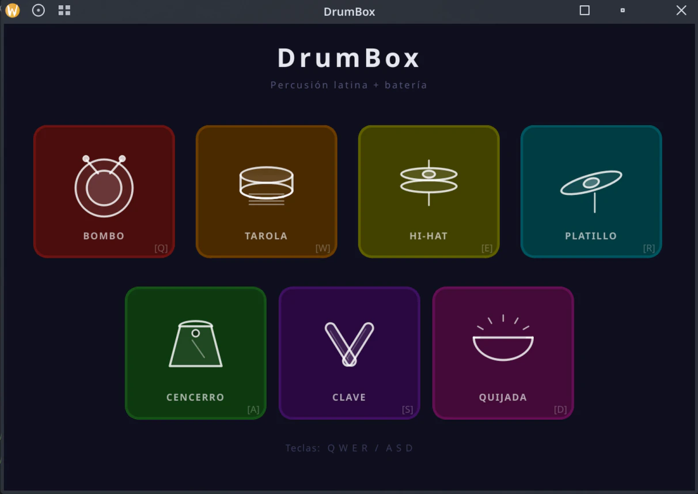

# music-drums

[](https://opensource.org/licenses/Apache-2.0)


[](https://github.com/rgglez/music-drums/releases/)


A simple drum kit built in response to a question from Michel Geiss about instrument building with Claude Code.

## Screenshot



## Sounds

- Bass drum.
- Snare drum.
- Hi-hat.
- Cymbal.
- Cowbell.
- Quijada.
- Clave.

## Build with Make

### Requirements

- `g++`
- `make`
- `pkg-config`
- Qt 6 development packages (`Qt6Core`, `Qt6Gui`, `Qt6Widgets`)
- PipeWire development package (`libpipewire-0.3`)

### Build

```bash
make
```

### Run

```bash
make run
```

### Cleanup

```bash
make clean      # removes build artifacts
make distclean  # removes build artifacts + DrumBox binary
```

## Usage

Just hit the pads with the mouse.

## License

Copyright 2026 Rodolfo González González.

Licensed under [Apache License 2.0](LICENSE).

